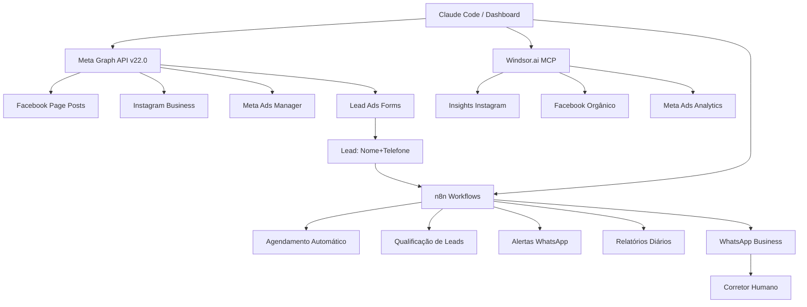

# META AUTOMATION ARCHITECTURE
## Escritório Campos Figueira — Arquitetura de Automação

---

## 1. VISÃO GERAL



---

## 2. COMPONENTES E RESPONSABILIDADES

| Componente | Função | Status |
|-----------|--------|--------|
| Next.js Dashboard | UI de controle e agendamento | ✅ Ativo |
| Meta Graph API v22.0 | Publicar posts, agendar, criar anúncios | ✅ Configurado |
| Windsor.ai MCP | Ler métricas de Instagram/Facebook/Meta Ads | ✅ Conectado |
| n8n | Automações: leads, alertas, posts automáticos | ⏳ Pendente |
| Supabase | CRM de leads, histórico | ⏳ Futuro |
| WhatsApp Business | Receber leads, notificar corretor | ⏳ Pendente |

---

## 3. FLUXO DE PUBLICAÇÃO DE CONTEÚDO

```
Calendário JSON (src/content/calendario-julho-2026.json)
    ↓
/agendador (Next.js page)
    ↓
[FACEBOOK] POST /api/meta/agendar
    → Graph API: /{page-id}/feed
    → published: false + scheduled_publish_time
    → Meta publica automaticamente na data/hora

[INSTAGRAM] POST /api/meta/publicar-instagram
    → Graph API: /{ig-user-id}/media (container)
    → Polling status até FINISHED
    → Graph API: /{ig-user-id}/media_publish
    → Post publicado imediatamente
```

---

## 4. FLUXO DE LEADS

```
Meta Lead Ads Form
    ↓
Webhook → n8n
    ↓
Parse: nome, telefone, interesse, imóvel
    ↓
Score: QUENTE / MORNO / FRIO
    ↓
Notify: WhatsApp → Corretor (com contexto completo)
    ↓
Store: Supabase / Google Sheets (CRM)
    ↓
[se QUENTE] Auto-reply WhatsApp Business
    ↓
Handoff: atendimento humano
```

---

## 5. MODELO DE PERMISSÕES META

| Operação | Permissão | Nível |
|----------|-----------|-------|
| Publicar posts Facebook | pages_manage_posts | Page |
| Ler insights Facebook | pages_read_engagement | Page |
| Publicar Instagram | instagram_content_publish | IG Business |
| Ler perfil Instagram | instagram_basic | IG Business |
| Receber leads | leads_retrieval | App |
| Criar campanhas pagas | ads_management | Ad Account |
| Ler campanhas | ads_read | Ad Account |

---

## 6. VARIÁVEIS DE AMBIENTE

```bash
META_PAGE_TOKEN=     # Page Access Token permanente
META_PAGE_ID=512040582222121
META_IG_USER_ID=17841461388445580
META_APP_ID=
META_APP_SECRET=
N8N_WEBHOOK_URL=
ANTHROPIC_API_KEY=   # Para agentes autônomos futuros
```

---

## 7. POLÍTICA DE APROVAÇÃO

**Ações que exigem aprovação EXPLÍCITA:**
- Publicar post orgânico
- Criar campanha paga
- Alterar orçamento de campanha
- Pausar ou ativar campanha
- Enviar mensagem em massa

**Processo:**
1. Executar `/criar-pacote-aprovacao`
2. Usuário responde "APROVAR"
3. Sistema registra aprovação no log
4. Executa ação
5. Registra resultado no audit-logs/

---

## 8. PLANO DE ROLLBACK

| Ação | Como Reverter | Tempo |
|------|--------------|-------|
| Post Facebook agendado | DELETE /{post-id} | < 1 min |
| Post Instagram publicado | DELETE /{media-id} | < 1 min |
| Campanha criada | PATCH status=PAUSED | < 1 min |
| Orçamento aumentado | PATCH budget=valor_anterior | < 1 min |
| n8n workflow ativado | Desativar no painel n8n | < 2 min |

---

*Arquitetura v1.0 — Escritório Campos Figueira — Junho/2026*
